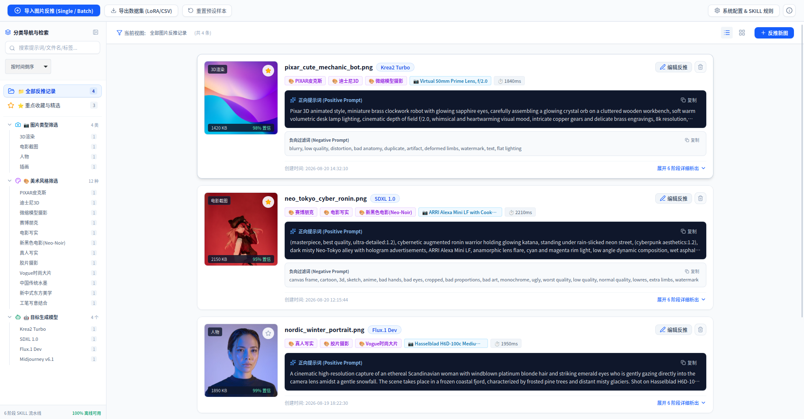
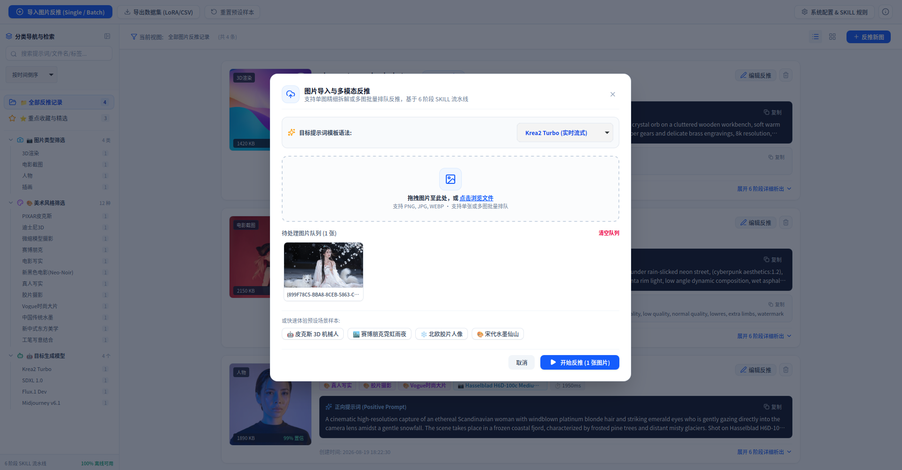
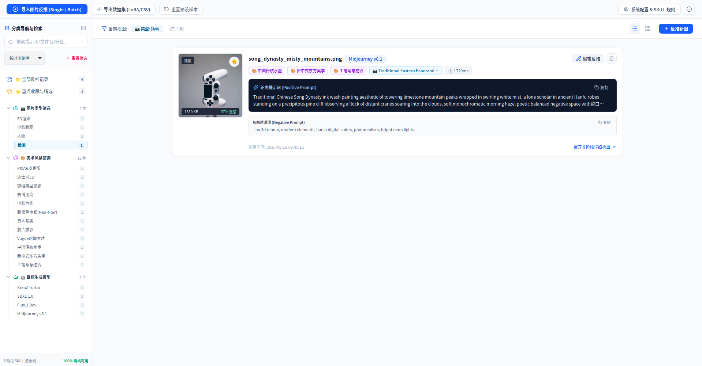
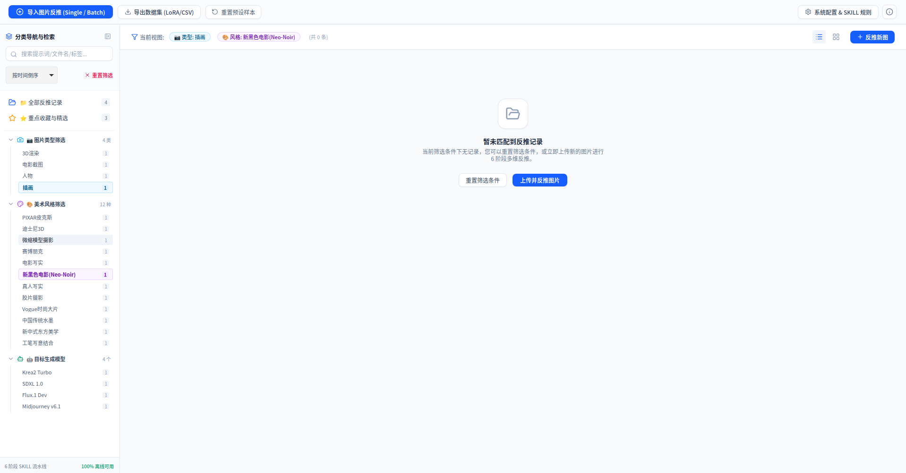
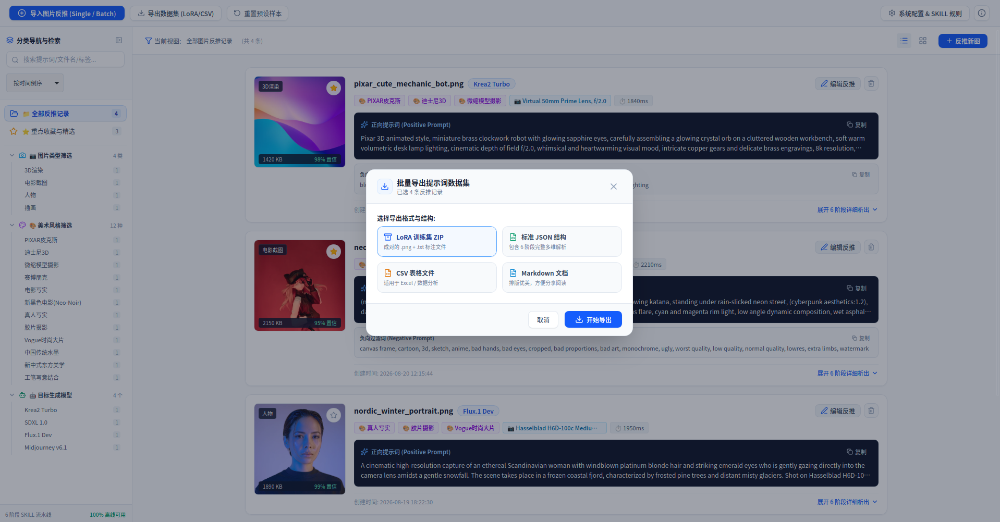
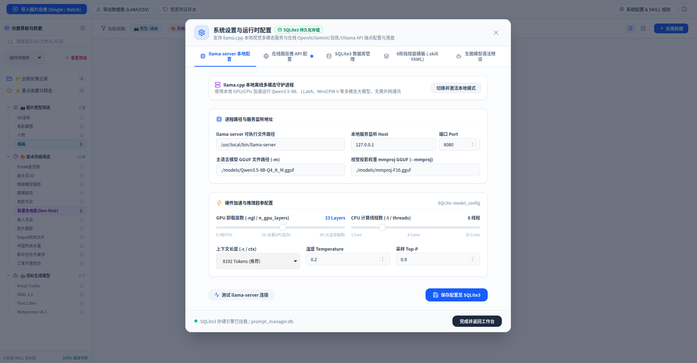
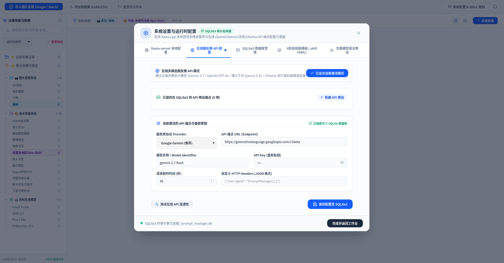
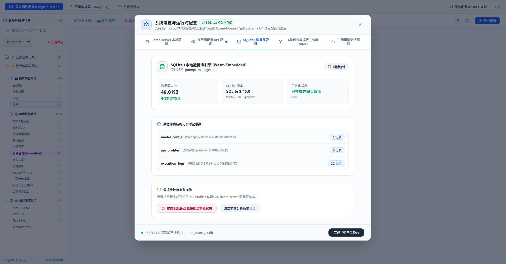
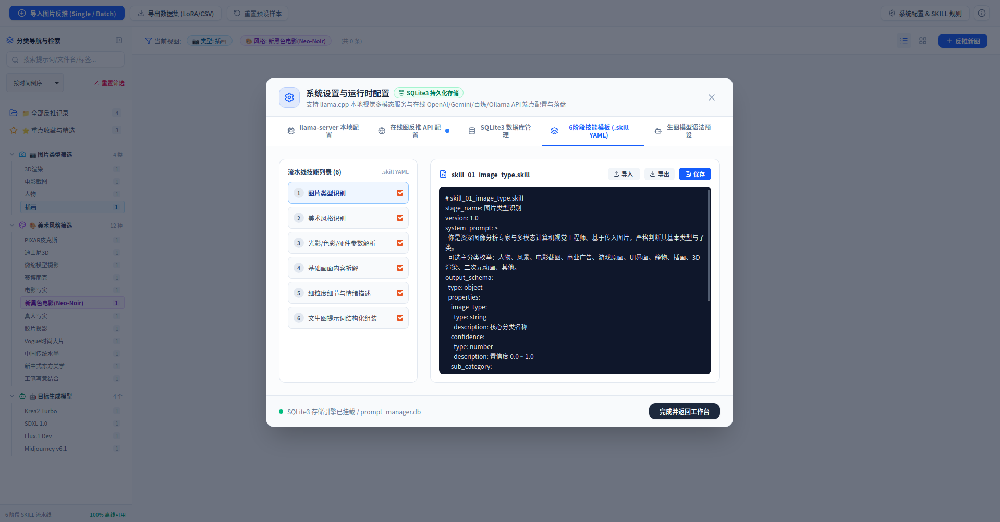
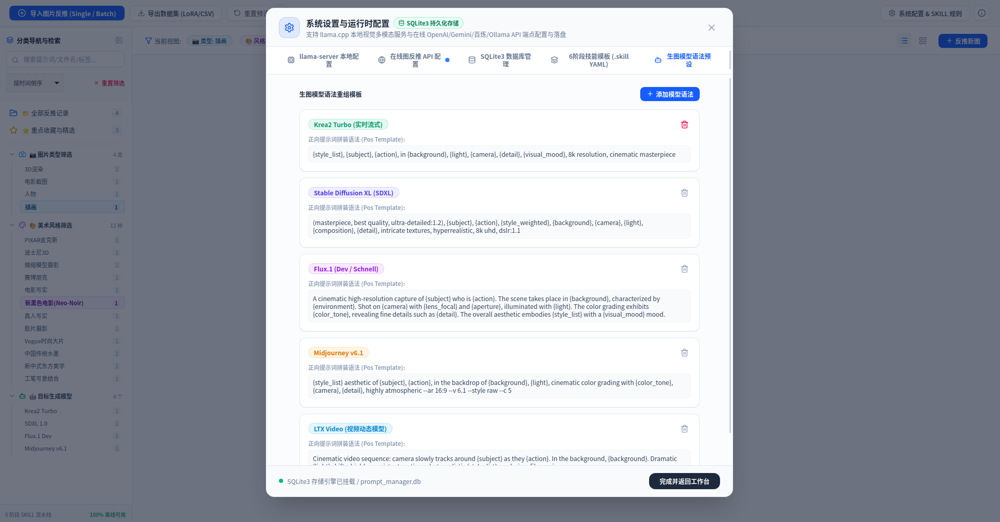

<div align="center">

# 🎨 Prompt Manager (提示词反推与数据集工坊)

**基于多模态大模型与 6 阶段 SKILL 分解流水线的高性能图片反推提示词与 LoRA 训练集制作工具**

[](https://opensource.org/licenses/Apache-2.0)
[](https://react.dev/)
[](https://www.typescriptlang.org/)
[](https://tailwindcss.com/)
[](https://www.sqlite.org/)
[](https://github.com/ggerganov/llama.cpp)

[English Documentation](./README.EN.md) • [项目主页](./README.md)

---

</div>

## 📖 目录

- [💡 项目简介](#-项目简介)
- [✨ 核心亮点](#-核心亮点)
- [🖼️ 界面截图与功能预览](#️-界面截图与功能预览)
  - [1. 主工作台与反推卡片](#1-主工作台与反推卡片)
  - [2. 图片导入与批量反推](#2-图片导入与批量反推)
  - [3. 多维分类导航与精准筛选](#3-多维分类导航与精准筛选)
  - [4. LoRA 训练集与多格式批量导出](#4-lora-训练集与多格式批量导出)
  - [5. 系统设置与 llama-server 本地加速](#5-系统设置与-llama-server-本地加速)
  - [6. 在线 API 多端点与 SQLite3 数据库管理](#6-在线-api-多端点与-sqlite3-数据库管理)
  - [7. 6 阶段技能模板与生图语法配置](#7-6-阶段技能模板与生图语法配置)
- [🧩 6 阶段 SKILL 分解流水线](#-6-阶段-skill-分解流水线)
- [🎯 多引擎语法模板支持](#-多引擎语法模板支持)
- [📦 批量数据集与 LoRA 训练集导出](#-批量数据集与-lora-训练集导出)
- [🚀 快速上手](#-快速上手)
  - [1. 环境要求](#1-环境要求)
  - [2. 安装与运行](#2-安装与运行)
  - [3. 构建与部署](#3-构建与部署)
- [⚙️ 配置与架构说明](#️-配置与架构说明)
  - [环境变量配置](#环境变量配置-env)
  - [技术栈架构](#技术栈架构)
- [📄 开源协议](#-开源协议)

---

## 💡 项目简介

**Prompt Manager** 是一款专为 AI 创作者、LoRA 模型训练师和数字艺术家设计的**多模态图片反推提示词与数据集工坊**。

传统单次提示词反推往往存在细节丢失、风格混杂、语法混乱等问题。本项目创新性地采用了 **6 阶段模块化 SKILL 规则流水线**，对输入图像进行层层拆解，精确解析其类型、流派、相机摄影参数、场景主体与微观质感，并自动适配 **SDXL、Flux.1、Krea2、Midjourney v6** 等主流生图引擎的语法规则。

---

## ✨ 核心亮点

- 🔬 **6 阶段模块化分解流水线**：摒弃单一模糊推理，采用 6 个独立 `.skill` 规则文件管控每一阶段，支持实时可视化执行状态、耗时与结构化 JSON Schema 校验。
- 🔄 **双模式多模态推理后端**：
  - **模式 A (离线隐私)**：本地运行 `llama.cpp` + `Qwen3.5-9B-Q4_K_M.gguf` + `mmproj-F16.gguf` 视觉投影，100% 离线、数据零外流、支持 GPU Offload。
  - **模式 B (在线加速)**：无缝直连 Google Gemini 3.7 Multimodal / OpenAI 兼容格式多模态 API，提供毫秒级极速反推。
- 🎯 **主流生图引擎语法模板引擎**：
  - **SDXL 经典权重语法**：`masterpiece, best quality, (photorealistic:1.3), ...`
  - **Flux.1 自然语言长叙述**：精准物理光影、材质交互与构图关系。
  - **Krea2 紧凑标签流**：高信息密度视觉关键词。
  - **Midjourney v6 参数化命令**：`--ar 16:9 --v 6.0 --style raw --q 2`
- 💾 **SQLite 本地持久化**：历史反推记录、自定义 SKILL 规则、模型配置与生图模板全部存储于本地数据库，支持模糊搜索、分类筛选、树形导航与快速复制。
- 📦 **一键批量 LoRA 数据集打包**：支持将选中的反推结果一键导出为标准的 **LoRA 训练集压缩包 (`image.png` + `image.txt` 配对)**、JSON 结构体、CSV 表格或 Markdown 文档。
- 🖥️ **专业现代化工作台 UI**：采用专业中性灰/深海蓝设计语言，内置可折叠侧边树形目录、实时阶段流水线监视器与多格式即时拷贝工具。

---

## 🖼️ 界面截图与功能预览

### 1. 主工作台与反推卡片
直观呈现高置信度提示词、负向过滤词、美术标签、摄影硬件参数与 6 阶段流水线详细展开。
<div align="center">
  
</div>

<br/>

### 2. 图片导入与批量反推
支持拖拽图片、单图精细拆解、多图批量排队反推，并支持一键切换目标生图语法。
<div align="center">
  
</div>

<br/>

### 3. 多维分类导航与精准筛选
基于图片类型（3D渲染/电影截图/插画等）、艺术流派（赛博朋克/中国水墨/新黑色电影等）与目标模型的复合筛选系统。
<div align="center">
  
</div>

<div align="center">
  
</div>

<br/>

### 4. LoRA 训练集与多格式批量导出
一键导出标准配对的 `.png` + `.txt` LoRA 训练压缩包 (ZIP)，亦支持标准 JSON 结构化数据、CSV 表格与 Markdown 排版文档。
<div align="center">
  
</div>

<br/>

### 5. 系统设置与 llama-server 本地加速
可视化配置 `llama.cpp` 本地守护进程，灵活调整 GPU 卸载层数 (`n_gpu_layers`)、CPU 线程数、上下文长度与即时连通性测试。
<div align="center">
  
</div>

<br/>

### 6. 在线 API 多端点与 SQLite3 数据库管理
支持 Gemini、OpenAI、百炼通义千问、Ollama 等多服务商 API 预设保存与一键切换；内置 SQLite3 嵌入式数据库状态监控与维护。
<div align="center">
  
</div>

<div align="center">
  
</div>

<br/>

### 7. 6 阶段技能模板与生图语法配置
支持实时在线编辑、导入、导出 6 阶段 `.skill` YAML 规则，并可按需自定义不同生图模型的正向词拼接语法。
<div align="center">
  
</div>

<div align="center">
  
</div>

---

## 🧩 6 阶段 SKILL 分解流水线

| 阶段编号 | 规则标识 | 阶段名称 | 核心职责 | 输出示例 |
| :--- | :--- | :--- | :--- | :--- |
| **Stage 01** | `skill_01_image_type` | 图片类型识别 | 图像大类与载体类型识别 | 纪实摄影 (Documentary Photography), 3D 渲染, 赛博朋克插画 |
| **Stage 02** | `skill_02_image_style` | 美术流派风格 | 艺术流派、色调与视觉风格 | 赛博朋克 (Cyberpunk), 印象派, 新表现主义, 胶片颗粒色调 |
| **Stage 03** | `skill_03_camera_param` | 灯光摄影硬件 | 摄影硬件、镜头焦段与光影 | 85mm f/1.4 大光圈, 丁达尔体积光, 边缘轮廓光, 伦勃朗光 |
| **Stage 04** | `skill_04_scene_content` | 基础主体背景 | 空间构图、主体位置与环境 | 三分法则构图, 雨夜霓虹街头, 佩戴发光全息面具的主体 |
| **Stage 05** | `skill_05_detail_desc` | 细粒度微观描述 | 微观质感、材质反光与细节 | 皮肤毛孔微距纹理, 碳纤维编织反光, 潮湿路面积水倒影 |
| **Stage 06** | `skill_06_prompt_generate` | 提示词组装 | 多引擎格式化正/负向提示词组装 | 格式化组装正向英文 Prompt 与 Negative 过滤词 |

---

## 🎯 多引擎语法模板支持

系统内置了针对不同生图引擎的语法注入模板，并支持在设置面板中自由添加、编辑与重置：

```yaml
# SDXL 语法模板示例
positive: "masterpiece, best quality, ultra-detailed, {type}, {style}, {camera}, {scene}, {details}, cinematic lighting, 8k resolution"
negative: "lowres, bad anatomy, bad hands, text, error, missing fingers, cropped, worst quality, low quality, normal quality, jpeg artifacts, signature, watermark, username, blurry"

# Midjourney v6 语法模板示例
positive: "{type}, {style}, {scene}, detailed textures: {details}, shot on {camera} --ar 16:9 --v 6.0 --style raw"

# Flux.1 自然叙述模板示例
positive: "A photograph of {scene}, captured in {style} style. The lighting is {camera}. Key details include {details}. High fidelity, natural textures."
```

---

## 📦 批量数据集与 LoRA 训练集导出

在主界面批量勾选图片记录后，点击 **批量导出**，即可选择：

1. **LoRA 训练集 ZIP**：自动解压后为成对的 `001.png` + `001.txt`，txt 内为反推的正向提示词，开箱即用投入 Kohya_ss / WebUI 训练。
2. **JSON 数据包**：包含 6 阶段全量分解参数、模型配置、时间戳与标签元数据。
3. **CSV 表格**：适合数据分析与批量比对。
4. **Markdown 格式文档**：排版清晰，便于团队文档分享与归档。

---

## 🚀 快速上手

### 1. 环境要求
- Node.js 18.0+ / Bun / pnpm
- (可选) 本地 llama.cpp 二进制文件与 GGUF 模型（若使用离线模式）

### 2. 安装与运行
```bash
# 1. 克隆项目
git clone https://github.com/ajoesoft/prompt-manager
cd prompt-manager

# 2. 安装依赖
npm install

# 3. 复制环境变量配置
cp .env.example .env

# 4. 启动开发服务器
npm run dev
```
打开浏览器访问 `http://localhost:3000` 即可开始使用。

### 3. 构建与部署
```bash
npm run build
npm start
```

---

## ⚙️ 配置与架构说明

### 环境变量配置 (`.env`)
```env
# Gemini 多模态 API Key (若使用在线模式)
GEMINI_API_KEY=your_gemini_api_key_here
```

### 技术栈架构
- **前端核心**：React 18, TypeScript, Tailwind CSS, Lucide React, JSZip
- **后端服务**：Express.js (Vite Middleware 驱动，支持服务端安全 API 代理与 SQLite 交互)
- **多模态引擎**：@google/genai (在线推理) / llama-server (离线 Qwen-VL GGUF)
- **持久化数据库**：本地嵌入式 SQLite3 关系型表结构

---

## 📄 开源协议

本项目采用 [Apache-2.0 License](https://opensource.org/licenses/Apache-2.0) 开源协议。
